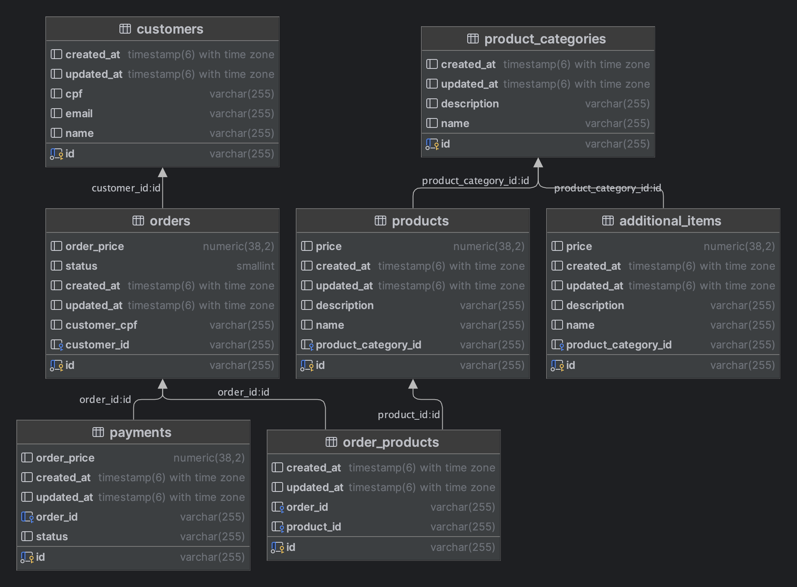

# Tech Challenge Phase 3
Pos Tech FIAP project

## Team Members
- Gabriel Martins de Miranda - rm352234
- Thiago Merino Rodrigues Barbosa - rm351475
- Guilherme Mazzei Graf - rm351411
- Erich Nelson Silveira Pinton - rm351414

# Justificativa para Utilização de Banco de Dados SQL

## Introdução
No desenvolvimento de um sistema de entrega de comida, a escolha do sistema de gerenciamento de banco de dados (SGBD) desempenha um papel crucial na eficiência, escalabilidade e integridade dos dados. Optamos pelo uso de um banco de dados SQL devido às características específicas do projeto, que envolvem as tabelas `customers`, `orders`, `payments`, `product_categories`, `products` e `additional_items`.

## Estrutura Relacional
O modelo relacional oferecido pelo banco de dados SQL é altamente adequado para representar a inter-relação complexa entre as entidades envolvidas no sistema. Cada tabela representa uma entidade específica e as relações entre elas são estabelecidas através de chaves estrangeiras, garantindo integridade referencial e facilitando consultas complexas.

### Tabelas
1. **customers:** Armazenará informações sobre os clientes.

2. **orders:** Registrará detalhes sobre cada pedido feito pelos clientes, incluindo a data, o cliente associado e o status do pedido.

3. **payments:** Gerenciará informações relacionadas aos pagamentos, como método de pagamento, valor e status de pagamento.

4. **product_categories:** Manterá categorias de produtos para facilitar a organização e navegação dentro do sistema.

5. **products:** Armazenará dados detalhados sobre cada produto disponível para pedido, incluindo nome, descrição e preço.

6. **additional_items:** Oferecerá suporte a itens adicionais que podem ser incluídos em um pedido, como acompanhamentos ou extras.

7. **order_products:** Armazenará os produtos do pedido, permitindo a associação de produtos a pedidos específicos.

### Diagrama

## Consultas Complexas
A linguagem SQL proporciona a capacidade de realizar consultas complexas de maneira eficiente, permitindo a recuperação de dados específicos, agregações e filtragem com relativa facilidade. Isso é crucial em um sistema de entrega de comida, onde a rápida recuperação de informações precisas, como histórico de pedidos de um cliente ou produtos mais vendidos, é essencial para a tomada de decisões operacionais.

## Transações e Consistência
Os bancos de dados SQL são conhecidos por oferecerem suporte a transações, garantindo atomicidade, consistência, isolamento e durabilidade (ACID). Em um ambiente de entrega de comida, onde a manipulação de pedidos e pagamentos ocorre frequentemente, a garantia de que as transações sejam tratadas de maneira segura e consistente é fundamental para evitar problemas como pedidos duplicados ou inconsistências nos registros financeiros.

## Conclusão
Em resumo, a escolha do banco de dados SQL é fundamentada nas necessidades específicas do sistema, onde a estrutura relacional, a capacidade de consultas complexas e a garantia de integridade transacional desempenham um papel crucial na eficiência e confiabilidade do sistema. O uso de tabelas como `customers`, `orders`, `payments`, `product_categories`, `products`, `additional_items` e `order_products` reflete a abordagem organizada e escalável adotada para atender aos requisitos do projeto.
